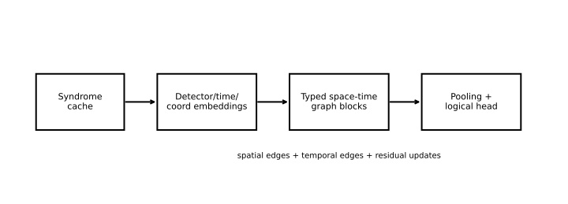

# Architecture

This page describes NanoQEC at the level a human collaborator usually needs:
what flows through the system, which parts are stable, which parts are mutable,
and how results become auditable artifacts. It deliberately stays above the
schema and implementation details frozen by the authority docs.

## Implemented Today

As of April 9, 2026, NanoQEC is organized around a deterministic local research
loop: prepare profile data, train a decoder, evaluate it against MWPM, and keep
or discard the outcome using explicit artifacts and benchmark policy.

## Future Direction

Cloud scaling, new orchestration layers, and broader autonomy remain future
project phases. This page only describes the architecture that the repository
documents today.

## High-Level Flow

```text
prepared profile data -> train.py -> checkpoint + metrics -> eval.py -> evaluation JSON + plot
```

At a slightly richer level:

1. `prepare.py` materializes a deterministic profile and writes a manifest.
2. `train.py` consumes that manifest, trains a decoder, writes checkpoints and
   metrics, and emits a machine-parseable `RESULT` line.
3. `eval.py` loads a checkpoint plus the same manifest and reports aggregate and
   per-slice results against MWPM.
4. Humans or agents compare those results to the benchmark policy and decide
   whether a change should be kept, discarded, or promoted.

## Stable vs Mutable Surfaces

The repo intentionally separates:

- stable public interfaces: entrypoints, shared artifacts, protected schemas,
  and evaluation rules
- mutable research internals: model family, optimizer/scheduler choices, loss
  shaping, and internal module layout under `src/nanoqec/`

That separation is what allows repeated decoder work without silently changing
what “a result” means.

## Human-Oriented System View



Source figure:
[../../paper/how-low-can-you-go/figures/architecture_overview.pdf](../../paper/how-low-can-you-go/figures/architecture_overview.pdf)

## Artifact Landmarks

- `data/`: prepared profile datasets and manifests
- `checkpoints/`: saved model checkpoints
- `results/train/`: training metrics JSON
- `results/eval/`: evaluation metrics JSON and plots
- `results/experiments.jsonl`: experiment log across runs

Human-facing docs use those artifacts as evidence, but the exact schema and
protected behavior remain defined in [../implementation-v0.md](../implementation-v0.md).

## Why the Architecture Works for Human + Agent Collaboration

- humans can inspect the same artifacts that an agent used
- agents can be constrained to stable public entrypoints
- benchmark policy is explicit enough to audit promotion decisions afterward
- repo-local authority docs remain the source of truth

## Where to Go for Exact Contracts

Read these when precision matters more than overview:

- [../../AGENTS.md](../../AGENTS.md)
- [../implementation-v0.md](../implementation-v0.md)
- [../hermes-ops.md](../hermes-ops.md)

## Next Reads

- [Concepts](./concepts.md)
- [Results and evidence](./results.md)
- [Using Hermes safely](./using-hermes.md)
