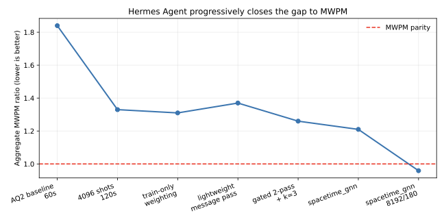
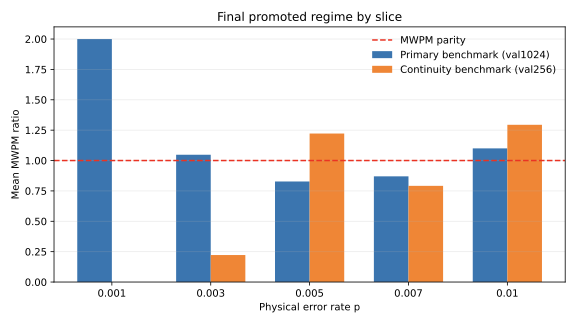
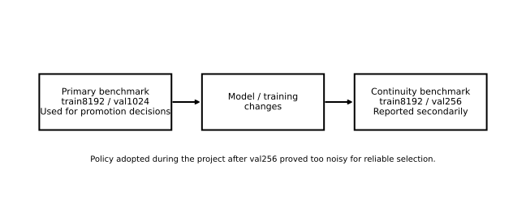

# Results and Evidence

This page is the human-readable status page for NanoQEC’s main `local-d3-v1`
story. It summarizes the promoted result, the benchmark policy behind it, the
figures worth looking at first, and the limits of what the evidence supports.

## Implemented Today

As of April 9, 2026, the repository’s strongest documented human-facing result
is the promoted `local-d3-v1` `spacetime_gnn` regime recorded on March 24, 2026
and explained further in the paper draft and blog post under `paper/`.

## Future Direction

Future research directions remain open, especially larger graph-native models,
new evaluation standards, and further `local-d5-v1` work. Those are future
phases, not claims supported by the evidence summarized here.

## Headline Result

The promoted `local-d3-v1` regime is:

- model: `spacetime_gnn`
- model defaults: `d_model=64`, `n_blocks=6`, `feedforward_mult=6`
- training data: `8192` train shots
- duration: `180s`
- primary benchmark: `train8192 / val1024`
- continuity benchmark: `train8192 / val256`

Source:
[../../results/overnight/hermes-d3-final-promotion-20260324.md](../../results/overnight/hermes-d3-final-promotion-20260324.md)

## Evidence Table

### Primary benchmark: `train8192 / val1024`

| Seed date | Aggregate val LER | Aggregate MWPM ratio |
| --- | ---: | ---: |
| 2026-03-23 | 0.02539 | 0.9420 |
| 2026-03-24 | 0.02578 | 0.9565 |
| 2026-03-25 | 0.02637 | 0.9783 |
| Mean | - | 0.959 |

### Continuity benchmark: `train8192 / val256`

| Seed date | Aggregate val LER | Aggregate MWPM ratio |
| --- | ---: | ---: |
| 2026-03-23 | 0.02422 | 1.0000 |
| 2026-03-24 | 0.02656 | 1.0968 |
| 2026-03-25 | 0.02578 | 1.0645 |
| Mean | - | 1.054 |

### Default-path sanity run

The same promotion summary records one default-path sanity run on the primary
benchmark:

- `aggregate_val_ler = 0.02421875`
- `aggregate_mwpm_ratio = 0.8986`

## Benchmark Policy

The benchmark-policy story has two important dated checkpoints:

1. [../../results/overnight/hermes-d3-overnight-20260324-policy-adoption.md](../../results/overnight/hermes-d3-overnight-20260324-policy-adoption.md)
   records the shift away from a noisier `val256`-led research flow toward a
   `val1024`-led decision lane on March 24, 2026.
2. [../../results/overnight/hermes-d3-final-promotion-20260324.md](../../results/overnight/hermes-d3-final-promotion-20260324.md)
   records the final promoted `train8192 / val1024` primary benchmark and the
   `train8192 / val256` continuity benchmark, also dated March 24, 2026.

For the paper and blog narrative, the key point is simple: larger validation
evidence changed which hypotheses looked genuinely better.

## Figures

### Milestone trajectory

This figure shows the high-level path from the early AQ2-style baseline to the
promoted graph-native decoder. Source figure:
[../../paper/how-low-can-you-go/figures/milestone_progress.pdf](../../paper/how-low-can-you-go/figures/milestone_progress.pdf)

### Final per-slice ratios

This figure shows how the final promoted regime compares to MWPM across the
physical-error-rate slices. Source figure:
[../../paper/how-low-can-you-go/figures/final_slice_ratios.pdf](../../paper/how-low-can-you-go/figures/final_slice_ratios.pdf)

### Benchmark-policy diagram

This figure summarizes the benchmark-policy framing used in the paper draft.
Source figure:
[../../paper/how-low-can-you-go/figures/benchmark_policy.pdf](../../paper/how-low-can-you-go/figures/benchmark_policy.pdf)

## Evidence Trail and Source Notes

These are the main repo-local sources behind the claims on this page:

- [../../results/overnight/hermes-d3-final-promotion-20260324.md](../../results/overnight/hermes-d3-final-promotion-20260324.md)
- [../../results/overnight/hermes-d3-retrospective-timeline-20260324.md](../../results/overnight/hermes-d3-retrospective-timeline-20260324.md)
- [../../results/experiments.jsonl](../../results/experiments.jsonl)
- [../../paper/how-low-can-you-go/blog_post.md](../../paper/how-low-can-you-go/blog_post.md)
- [../../paper/how-low-can-you-go/main_name_only.tex](../../paper/how-low-can-you-go/main_name_only.tex)

One important caveat: [../../results/eval/best-eval.json](../../results/eval/best-eval.json)
is a useful checked-in example of the evaluation artifact schema, but it is not
the headline promoted result. It records an older `val256`-scale evaluation
artifact with `aggregate_mwpm_ratio = 1.9032`.

## What This Result Does Not Mean

- It does not show that NanoQEC has solved general neural decoding.
- It does not show transfer to larger distances, new noise models, or hardware
  data.
- It does not imply that every benchmark lane beats MWPM.
- It does not replace the need for exact contract reading when changing code or
  evaluation logic.

## Next Reads

- [Overview](./overview.md)
- [Architecture](./architecture.md)
- [Contributing](./contributing.md)
